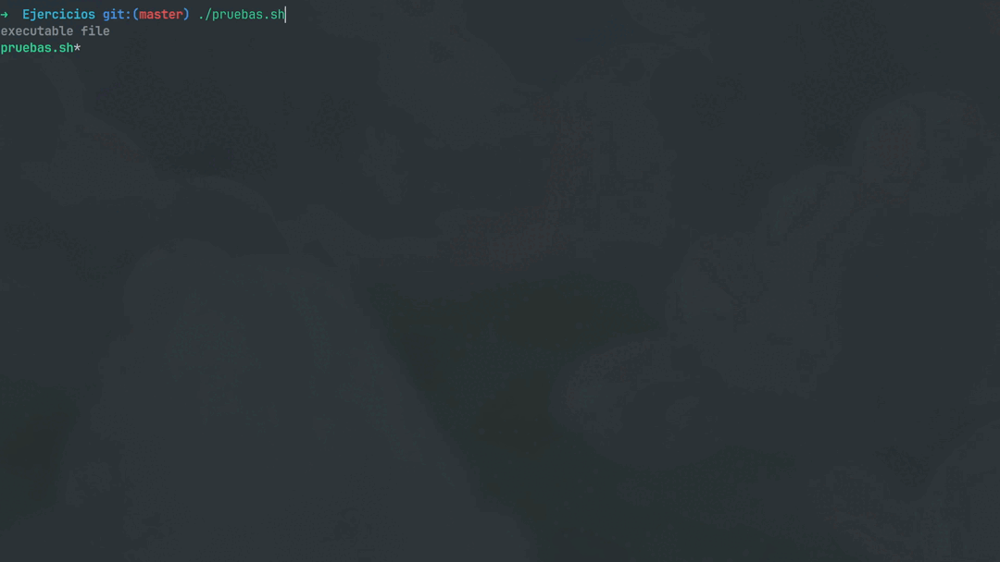

# PruebasAlgoritmos2  
Script de bash para correr las pruebas del obligatorio. Por defecto se corren las pruebas de todos los ejercicios que existen en el directorio que se ejecuta. También se puede correr pruebas de ejercicios específicos.
A medida que se suban las pruebas se actualizará para incluir soporte: ver [Ejercicios soportados](#ejercicios-soportados).

## Cómo Usar el Script

**1.**

Coloca el script en tu directorio de ejercicios. El mismo **debe** tener la siguiente estructura:
```
.
├── Pruebas
│   ├── Ejercicio1
│   ├── Ejercicio2
│   ├── Ejercicio3
│   ├── Ejercicio4
│   └── Ejercicio5
├── ejercicio1.cpp
├── ejercicio2.cpp
├── ejercicio3.cpp
├── ejercicio4.cpp
└── pruebas.sh
```
La carpeta `Pruebas` se genera al descomprimir el zip del [Drive de pruebas](https://drive.google.com/drive/folders/1_Lx4PVyFqzYHEYeCPD8w8RH0fdTyX92N).
Si no tienes todos los ejercicios no hay problema, el script verifica cuáles existen y corre las pruebas correspondientes.

**2.**

Si ejecutas el script sin argumentos, correrá las pruebas de todos los ejercicios existentes en el directorio actual:
```
./pruebas.sh
```
Si solo quieres correr las pruebas de uno o varios ejercicios específicos, pasa como argumento los números de los ejercicios. Ejemplo para solo correr las pruebas de los ejercicios 1 y 2:
```
./pruebas.sh 1 2
```
Solo ejercicio 1:
```
./pruebas.sh 1
```
La salida se ve así:
```
---------------------------
        Ejercicio 1
---------------------------
10.in.txt: OK
---------------------------
100.in.txt: OK
---------------------------
1000.in.txt: OK
---------------------------
10000.in.txt: OK
---------------------------
100000.in.txt: OK
---------------------------
1000000.in.txt: OK
```

## Funcionamiento

- Verifica qué ejercicios existen en el directorio actual
- Compila los ejercicios que existen utilizando `g++ -std=c++11`
- Genera los archivos de salida para pruebas (.out.mine.txt)
- Compara las salidas generadas con las salidas esperadas utilizando `diff --strip-trailing-cr`
- Borra los archivos generados (.out.mine.txt, .out)

Las salidas incorrectas no son borradas.

## Ejercicios soportados
- [x] Ejercicio 1
- [x] Ejercicio 2
- [x] Ejercicio 3
- [x] Ejercicio 4
- [x] Ejercicio 5
- [ ] Ejercicio 6
- [ ] Ejercicio 7
- [ ] Ejercicio 8
- [ ] Ejercicio 9
- [ ] Ejercicio 10
